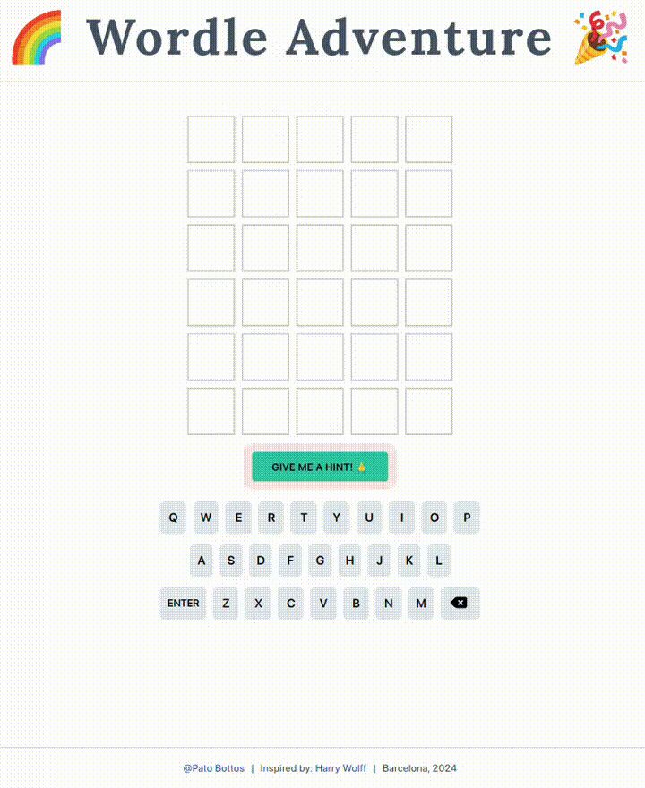

# 🌈 Kids Wordle Adventure 🎉

## React + TypeScript + Vite-Powered Fun! 🚀

Welcome to the colorful world of Kids Wordle, a delightful twist on the classic game! 🌟

Guess the hidden word by entering different combinations, and enjoy the challenge of word guessing! ✏️ 🎈

Embark on a language journey crafted with love for our young explorers, aged **between 7 and 11 years old**. 🧒 📚 ✨

## Table of Contents

- [Usage](#usage)
- [Features](#features)
- [Contributing](#contributing)
- [License](#license)

## Usage

To play the Wordle App online, simply visit [wordle-adventure.vercel.app](https://wordle-adventure.vercel.app/) in your web browser. No installation is required, and you can start playing right away.

## Features

The Wordle App comes with several features to enhance your word-guessing experience:

- **Feature 1:** Interactive and user-friendly interface.
- **Feature 2:** Dynamic word selection for an engaging challenge, out of a 500 words word bank, especially chosen for the younger ones.
- **Feature 3:** Real-time feedback on your word guesses.
- **Feature 4:** Hint button to help solve the quizz, with online definitions to help learn the meanings.

Explore these features to make your Wordle gaming experience enjoyable!

## Contributing

If you're interested in contributing to this project, please feel free to contact me at patobottos[at]gmail.com.

We appreciate your contributions and feedback!

## License

This project is licensed under the MIT License - see the [LICENSE.md](LICENSE.md) file for details.

## Credits

- **Developer**: [Pato Bottos](https://patobottos.vercel.app/)
- **Spiritual mentor!** [Harry Wolff](https://hswolff.com/)
- **Place and Date**: Barcelona, February 2024

## Contact Information

- Pato Bottos
- Email: patobottos[at]gmail.com

## Acknowledgments

I would like to acknowledge the following for their support and contributions to this project:

- [Harry Wolff's](https://www.youtube.com/watch?v=t_omcJmOQ_k) detailed explanation on his Reacdle creation process. ✨
- [Dictionary API](https://dictionaryapi.dev/), whose mission is to provide users with an API that they can use to build a game, learning application, or next-generation speech and text technology. 📚
- [Lottie Files](https://lottiefiles.com/), for creating and sharing such beautiful amimations! 🎉
- My family for their unwavering support and encouragement. ❤️

Enjoy playing Wordle!
